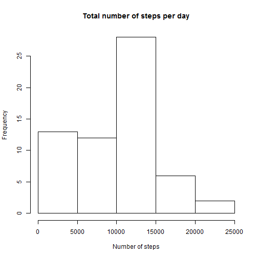
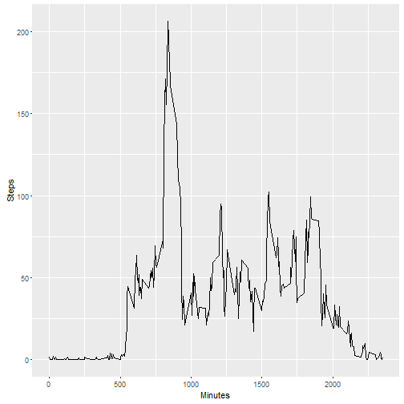
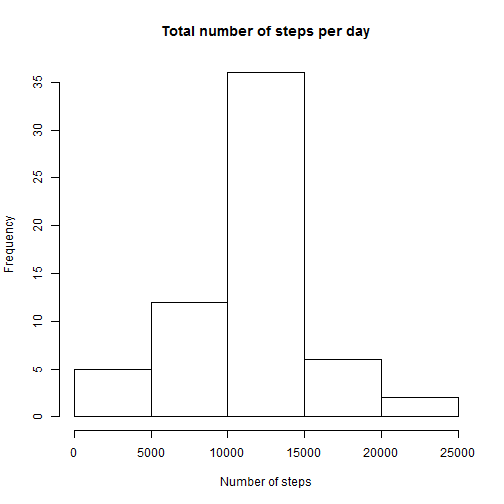
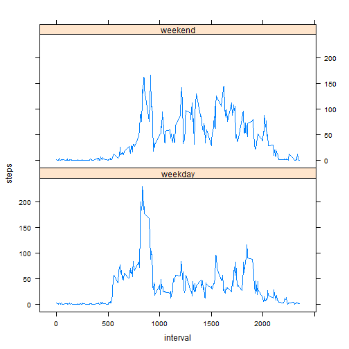

#Reproducible Research: Peer Assessment 1

## Data Analysis  

###Loading and preprocessing the data

Here's the code to *load the dataset*. It will work if activity.csv is in your working directory.  


```r
activity <- read.csv('activity.csv')
```

###What is mean total number of steps taken per day?  

Calculate the *total number of steps taken per day* and make a histogram: 


```r
total_steps <- aggregate(activity$steps, by = list(activity$date), FUN = sum, na.rm = TRUE)
hist(total_steps$x, xlab = "Number of steps", main = "Total number of steps per day")
```



Calculate the *mean* and *median* of the total number of steps taken per day: 


```r
total_steps_mean <- mean(total_steps$x)
total_steps_median <- median(total_steps$x)
```

Mean: 9354.23   
Median: 10395  

###What is the average daily activity pattern?  

Make a *time series plot* (i.e. type = "l") of the 5-minute interval (x-axis) and the average number of steps taken, averaged across all days (y-axis)


```r
average_steps <- aggregate(activity$steps, by = list(activity$interval), FUN = mean, na.rm = TRUE)
library(ggplot2)
qplot(average_steps$Group.1, y = average_steps$x, data = average_steps, geom = "line", xlab = "Minutes", ylab = "Steps")
```



Which 5-minute interval, on average across all the days in the dataset, contains the *maximum number of steps*?


```r
maxstep <- average_steps$Group.1[which.max(average_steps$x)]
```

The 835 interval contains the maximum number of steps.

###Imputing missing values  

Calculate and report the *total number of missing values* in the dataset


```r
NAs <- length(which(is.na(activity$steps)))
```

There are 2304 NAs in the dataset. 

Devise a strategy for filling in all of the missing values in the dataset.
Create a *new dataset* that is equal to the original dataset but with the missing data filled in.

We've chosen to fill the missing values with the average for that 5-minute interval.


```r
activity_imp <- activity
fillnas <- function(steps, interval) {
if(is.na(steps)) 
  filled <- average_steps[average_steps$Group.1 == interval, 2]
if(!is.na(steps))
  filled <- steps
return(filled)
}
activity_imp$steps <- mapply(fillnas, activity_imp$steps, activity_imp$interval)
```

Make a *histogram of the total number of steps taken each day* and ñalculate and report the mean and median total number of steps taken per day. 


```r
imp_total_steps <- aggregate(activity_imp$steps, by = list(activity_imp$date), FUN = sum, na.rm = TRUE)
hist(imp_total_steps$x, xlab = "Number of steps", main = "Total number of steps per day")
```



```r
imp_total_steps_mean <- mean(imp_total_steps$x)
imp_total_steps_mean
```

```
## [1] 10766.19
```

```r
imp_total_steps_median <- median(imp_total_steps$x)
imp_total_steps_median
```

```
## [1] 10766.19
```

  
Mean: 9354.23   
Median: 10395  


Do these values differ from the estimates from the first part of the assignment? What is the impact of imputing missing data on the estimates of the total daily number of steps?

Both the mean and the median have increased due to the imputing of missing number. Moreover, the mean noe is equal to the median. 
Total number of steps per day has also chanded. The number of days with the least steps decreased, because the days with missing numbers and small sum were imputed. 

###Are there differences in activity patterns between weekdays and weekends?  

Create a new factor variable in the dataset with two levels – “weekday” and “weekend” indicating whether a given date is a weekday or weekend day.


```r
Sys.setlocale(locale = "English")
```

```
## [1] "LC_COLLATE=English_United States.1252;LC_CTYPE=English_United States.1252;LC_MONETARY=English_United States.1252;LC_NUMERIC=C;LC_TIME=English_United States.1252"
```

```r
activity_imp$days <- weekdays(as.POSIXlt(activity_imp$date))
activity_imp$week <- ifelse(activity_imp$day %in% c("Saturday","Sunday"), 'weekend', 'weekday')
```

Make a panel plot containing a time series plot (i.e. type = "l") of the 5-minute interval (x-axis) and the average number of steps taken, averaged across all weekday days or weekend days (y-axis). 


```r
activity_imp_agg <- aggregate(steps ~ interval + week, data=activity_imp, FUN = mean)
library(lattice)
xyplot(steps ~ interval | week, data = activity_imp_agg, layout = c(1,2), type = "l")
```




